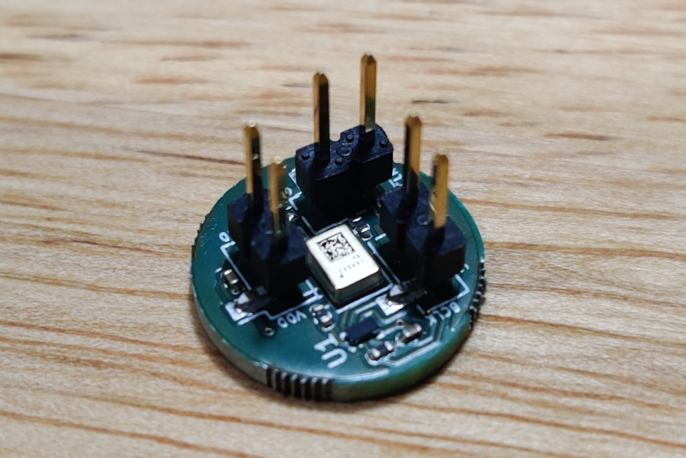
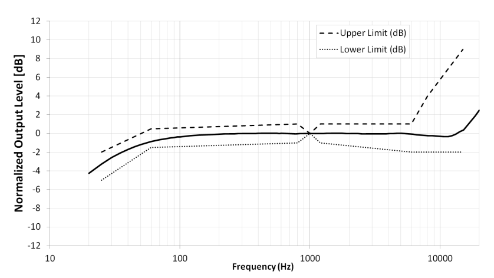
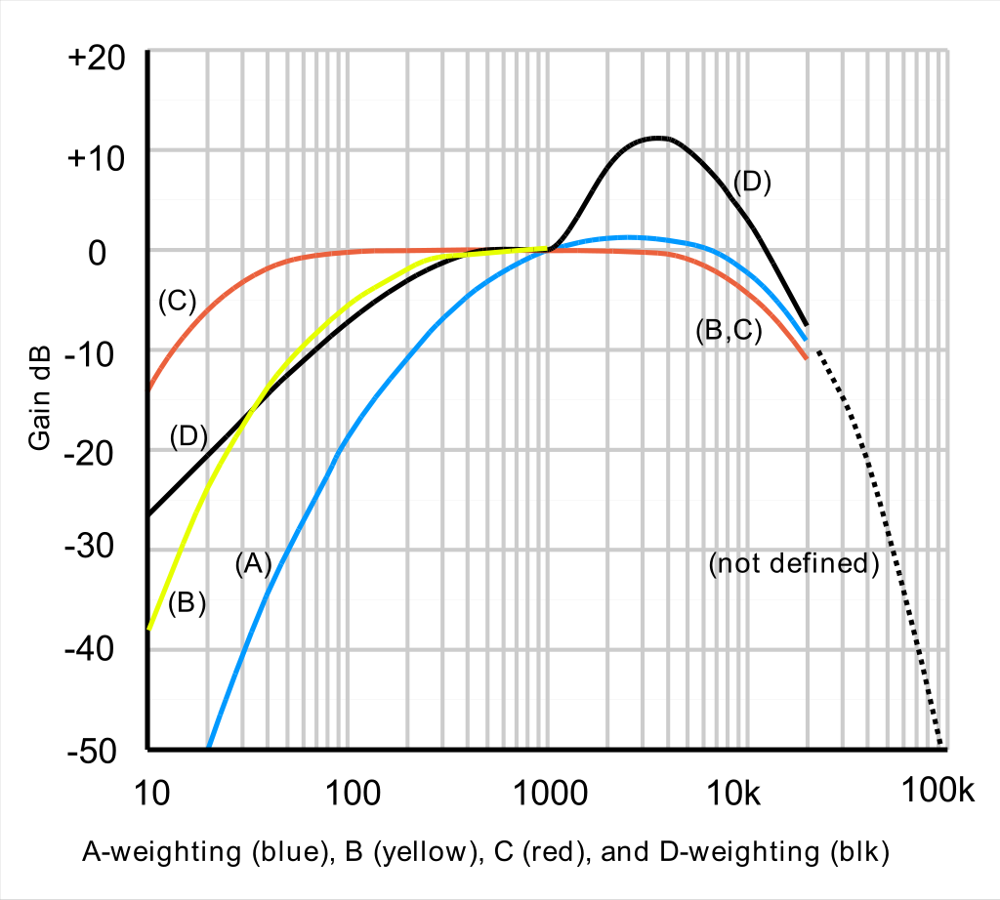

# ESP32-Klankentapper

Accurate dBA measurements with an ESP32 and an I2S MEMS microphone, for citizen science projects.

## 1. About ESP32-Klankentapper

The ESP32-Klankentapper is a sensor which serves to measure ambient noise around your house. You are able to observe this amount of noise around your house on an online dashboard. The sensor includes a microcontroller (ESP32 WROOM) and a custom designed PCB containing a powerfull MEMS microphone. The microcontroller is able to [calculate](#rms-and-dba-calculation) the amount of sound in dBA very precisely. This is the measure of sound tuned to the human hearing.

The ESP32-Klankentapper is a class 2 dBA meter, with a measured ±0.5dBA error at 1kHz, and ±0.7dBA variation between microphones. The noise floor of the sensor is 24.5dBA. The ESP32-Klankentapper can therefore be used as a ‘general grade’ meter. It is ideal for use in noise at work assessments, basic environmental measurements, entertainment noise, industrial hygiene, construction noise, and vehicle noise.

An ESP32-Klankentapper is an open source ambient sound meter, developed by [Makerspace Antwerpen](https://www.makerspacea.be/) for the [imec Hackable City of Things](https://www.imeccityofthings.be/en/projecten/hackable-city-of-things_2) initiative, in collaboration with [Gents Milieufront](https://www.gentsmilieufront.be/) and [Bewonersgroep Luchtbal Noord](https://www.facebook.com/BewonersgroepLuchtbalNoord/), and scientifically supported by [imec Waves onderzoeksgroep](https://www.waves.intec.ugent.be/).

## 2. What is an ESP32-Klankentapper?

A [hardware](/hardware/) sensor with [software](/main/), a [manual](/documentation/) and [cloud components](/documentation/data_processing.md).

### Hardware to build an ambient noise meter

This repository includes the [hardware design](/hardware/) to create an accurate dBA sensor based on a ESP32 and a custom designed PCB with the [Infineon IM69D120](https://www.infineon.com/cms/en/product/sensor/mems-microphones/mems-microphones-for-consumer/im69d120/) microphone. Furthermore, we used off-the-shelf parts, 3D prints and lasercuts as much as possible.

In this repository you can also find the [bill of materials](/documentation/readme.md), the process of [building a Klankentapper](/documentation/hardware.md), the [software setup](/documentation/software.md) and our [connectivity setup](/documentation/connectivity.md).

#### Choice of technology

After comparing the ST MP34DT01-M, Knowles SPH0645LM4H, Vesper VM3000 and Infineon IM69D120 microphones, we concluded that the latter can be used with good accuracy (<±1.5dBA) to measure environmental noise. The accuracy of the Infineon IM69D120 microphone and the hardware of the whole sound meter were thoroughly tested in the anechoic chamber of [Imec Waves](https://www.waves.intec.ugent.be/).

We have created a [custom designed PCB](https://github.com/Makerspace-Antwerpen/klankentappers-PCB) for our Infineon IM69D120 microphone. Besides the microphone this PCB also includes a [Analog Devices ADAU7002](https://www.analog.com/en/products/adau7002.html#product-overview) PDM-to-I2S converter chip. This allows you to read the audio data in both I2S and PDM format. Thanks to the consistency of the microphones among each other, we are able to use them with 1 standerd calibration (per batch produced).

### Software to analyse ambient noise

This repository includes the [software](/main/) used to correctly read the microphone data into the ESP32, correct it with IIR filters, calibrate it and correctly calculate dBA.

#### IIR filters

Our microphone, although carefully selected for the flattest possible frequency response, still has a frequency response that isn't completely flat. This is a problem that needs to be sorted before we can use the measurements for anything meaningful.

We also want to apply an A weighting filter to our signal, so the end values represent a DBA measurement. You can read more about the A-weighting of audio signals on [this link](https://en.wikipedia.org/wiki/A-weighting)

To achieve both of those things, we use IIR filters. These are a kind of digital filter that can be applied to a digital signal. You can read more about IIR filters on [this link](https://en.wikipedia.org/wiki/Digital_filter). The filter code used in iir-filter.hpp is universal. It is the filter coefficients that dictate the characteristics of the filter. Acquiring these filter coefficients requires some advanced mathematics that go out of scope for this document. You can find the used filter coefficients in the codebase on line 31-34 of [dbaMeasure.cpp](/main/dbaMeasure.cpp). Be advised that these values are sample rate specific and can thus be only used with a 48kHz sample rate.

The first filter used flattens the frequency response of the used microphone. The second filter applies the A-weighting to the audio signal before the RMS is calculated.

#### RMS and DBA calculation

We now have a leveled and then weighted audio signal. The next step is calculating a DBA value from this signal. The time interval over which this value is calculated is important. We chose for the fast standard. See [this](https://en.wikipedia.org/wiki/Sound_level_meter#Time_weighting) link for more information. The fast standard measures the sound level over an interval of 1/8th of a second. Therefore, we use 6000 (48000/8) samples for each rms DBA calculation. 
To calculate the RMS value we use the following formula:  
  
Where:  
  
  
After this we calculate the DBA value from this RMS value with the following formula:  
  
Where:  
 Correction db for dc value of mic. 0 in our case.  
 Sound level at which the  occurs.  
 RMS value that occurs at  sound level.  

The  and  values are experimentally acquired.

#### dBA measurement test results

The quality of the ESP32-Klankentapper was tested in the anechoic chamber of the [imec waves research group](https://www.waves.intec.ugent.be/) at the University of Ghent in Belgium.

Below are the test results of a 1kHz tone at different dBA levels. The dBA levels of the calibrated test microphone are on the X-axis, and dBA levels of the ESP32-Klankentapper are on the Y-axis. 

From these tests, we learned that the ESP32-Klankentapper sound level meter has an error of ±0.5dBA (for measurements above 30dBA) with a noise floor of 24.5dBA. Variations between different ESP32-Klankentappers is ±0.7dBA. Other tests with different spectra (e.g. pink noise) confirmed these error rates beyond 1kHz. These tests show that the ESP32-Klankentapper can be used as a general grade class 2 sound level meter.

## Build your own Klankentapper

1. [Bill of materials](/documentation/readme.md)
2. [Prepare the ESP32](/documentation/software.md)
3. [Build the hardware](/documentation/hardware.md)
4. [Wifi and MQTT configuration](/documentation/connectivity.md)
