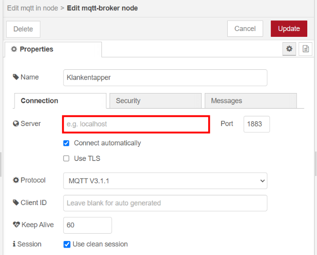

# Data processing

This document possesses some tutorials on how to process/visualize your Klankentapper data via a Raspberry Pi. We will provide links to the original websites if you want to setup these applications yourself.

## MQTT Broker

The most important part about MQTT is setting up our broker, this broker will act as a post office. Our ESP32 will send messages to a topic on said broker. Finally we will be able to subscribe to this topic with our client of choice and we will be able to receive these messages. We will be using the well-known [Mosquitto Broker](https://mosquitto.org/).

## Database

We would like to store our messages somewhere so that we can retrieve/review them later. This is why we will be using a database, in this example we will use the open source, time series based [InfluxDB](https://www.influxdata.com/).

## Data Transportation

InfluxDB cannot subscribe to our topic on its own, this is why we need to help transport our data to our database. We will show you 2 ways on how to do this:

### Node-red flow

This Nod-red flow ensures all our Klankentapper data will get to our database. We only need 3 nodes to be establish this flow:

#### *MQTT in node*

The first step is to add a server inside the "MQTT In" node and fill in your MQTT broker ip:

Next fill in your topic and set the output to "a parsed JSON object":

#### *JSON to float node*

This "function node" will serve as a JSON string to float converter. This step is important if you want to visualize your data as a time series graph. Just copy in the following code:

    msg.payload = Number(msg.payload.dBA);
    return msg;

Now it should look like this:

#### *InfluxDB node*

Finally we will configure our "InfluxDB out" node. First we will need to add InfluxDB support to our Node-red. Use the [palette manager](https://nodered.org/docs/user-guide/editor/palette/manager) and install the "node-red-contrib-influxdb" palette.

The first step is to add a server inside the "InfluxDB out" node, fill in your database URL and be sure to add the credentials of an **admin** user.

**Attention!** Be sure to check your InfluxDB version and adjust if necessary!

Next fill in your database and give your measurement a name:

Done! Don't forget to deploy! Now you are able to send data from your MQTT broker to your database.

### Python script

An other way to send data is via a python script. This python script is able to send data from your broker to your database while running in the background of your Raspberry Pi.

**Attention!** In order to run this script you will need [Python3](https://projects.raspberrypi.org/en/projects/generic-python-install-python3) and [Paho MQTT](https://pypi.org/project/paho-mqtt/)

First thing to do is make a new python script in your user directory (`cd ~/`) by making a new script, `nano my_new_script.py` and adding following code:

    from paho.mqtt import client as mqtt_client
    from influxdb import InfluxDBClient
    import json

    broker = 'broker_ip'
    port = 1883
    topic = "your/topic"
    client_id = f'a_client_id'

    influxdb = 'influxdb_ip'
    user = 'amdin_user'
    password = 'admin_password'
    database = 'your_database'

    influxdb_client = InfluxDBClient(influxdb, 8086, user, password, None)
    influxdb_client.switch_database(database)

    def connect_mqtt() -> mqtt_client:
        def on_connect(client, userdata, flags, rc):
            if rc == 0:
                print("Connected to MQTT Broker!")
            else:
                print("Failed to connect, return code %d\n", rc)

        client = mqtt_client.Client(client_id)
        client.on_connect = on_connect
        client.connect(broker, port)
        return client

    def subscribe(client: mqtt_client):
        def on_message(client, userdata, msg):
            print(f"Received `{msg.payload.decode()}` from `{msg.topic}` topic")
            data = json.loads( msg.payload.decode() )
            value = float( data["dBA"] )
            json_body = [
                {
                    'measurement': "measurement_name",
                        'fields': {
                            'value': value
                        }
                }
            ]
            influxdb_client.write_points(json_body)

        client.subscribe(topic)
        client.on_message = on_message

    def run():
        client = connect_mqtt()
        subscribe(client)
        client.loop_forever()

    if __name__ == '__main__':
        run()

The final step is to make this script run on boot. By following [these instructions](https://www.instructables.com/Raspberry-Pi-Launch-Python-script-on-startup/) you are able to accomplish that.

## Data Visualisation

Storing our data is fun and all but what about being able to perceive said data? We will be using two different application for this, [Grafana](https://grafana.com/) and [Node-Red](https://nodered.org/).

### Node-red UI

Aside from transporting data from our MQTT broker to our database we are also able to visualize said data inside Node-red. We will be using Node-red dashboard, [this tutorial](https://flows.nodered.org/node/node-red-dashboard) shows all you need to know about Node-red dashboard.

#### *Example*

As an example we will show you how we can visualize our data as a gauge:

1. Add a "gauge node" from the left menu inside your flow

2. Connect your "JSON to float" node to this node

3. Configure the Gauge node accordingly

All done!

### Grafana

Grafana is used for converting our data into a time series based graph, which makes monitoring/viewing our data much easier. The only thing we will need is the InfluxDB data source inside our Grafana web interface (under configuration):

Next thing we need to do is configure our influxDB data source settings according to our database:

* **URL**: This is the ip address of your Raspberry Pi or local computer where InfluxDB is running.
* **Access**: Just select "server (default)".
* **Database**: The name of your database inside InfluxDB.
* **HTTP method**: Select GET.
* **User** and **Password**: When you enable HTTP authentication, InfluxDB requires you to create at least one admin user before you can interact with the system.

Next when all settings are done we need to add a panel to our grafana dashboard of choice:

Finally we are able to add our time series graph by editing our query settings accordingly:

**Attention!** `Select measurement` needs to be adjusted according to the name you have given your measurement inside your database. You will know when something is wrong when your measurement does not show up inside this setting.

Apply the changes to your panel and be sure to add the auto-refresh setting in the top right corner of your dashboard. This way your panels will automatically update.

